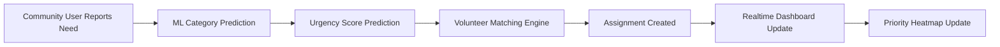

<div align="center">

# 🌍 ReliefLink
### AI-Powered NGO Coordination Platform

Transforming emergency response through intelligent prioritization, volunteer matching, and real-time geospatial coordination.


</div>

---

## 🚨 Problem Statement

During disasters and emergencies, communities often report needs through scattered channels like:

- WhatsApp
- Phone calls
- Social media
- Manual NGO coordination

This creates:

❌ delayed response times  
❌ duplicated efforts  
❌ poor visibility of urgent cases  
❌ inefficient volunteer allocation  

Organizations struggle to determine:

> Which requests are most urgent?  
> Who should respond?  
> Where should resources go first?

---

# 💡 Our Solution

ReliefLink is an **AI-powered humanitarian coordination platform** that centralizes emergency reporting and transforms it into prioritized actionable workflows.

Users can:

📍 Report emergencies  
📸 Upload evidence photos  
🧠 Get AI-powered prioritization  
🤝 Automatically match volunteers  
📊 Monitor live dashboards  
🗺️ Visualize crisis hotspots  

---

# ⚡ Core Workflow



---

# 🧠 AI + ML Features

ReliefLink integrates multiple intelligent components:

### 1. Need Category Prediction
Predicts:

```text
medical
food
shelter
rescue
logistics
other
```

Model:

- TF-IDF
- Logistic Regression

---

### 2. Urgency Score Prediction

Predicts:

```text
Urgency Score (1–10)
```

Model:

- Random Forest Regressor

---

### 3. Volunteer Matching Model

Predicts:

```text
Best volunteer probability
```

Model:

- Gradient Boosting Classifier

---

### 4. Region Hotspot Detection

Identifies:

```text
High-risk areas
```

Model:

- K-Means Clustering

---

# 🔥 Features

### Community Users

✅ Report emergency needs  
✅ Auto-location detection  
✅ Upload photos  
✅ Track request status  

---

### Volunteers

✅ Register skills & availability  
✅ View assigned tasks  
✅ Access live heatmap  
✅ Update task status  

---

### Admin

✅ Analytics dashboard  
✅ Assignment monitoring  
✅ Realtime heatmaps  
✅ System overview  

---

# 🛠 Tech Stack

## Frontend

- Next.js (App Router)
- React
- TypeScript
- Tailwind CSS
- Recharts
- React Leaflet

---

## Backend

- Node.js
- Next.js API Routes
- FastAPI

---

## Database & Cloud

- Firebase Firestore
- Firebase Authentication
- Firebase Storage

---

## AI / ML

- Scikit-learn
- Logistic Regression
- Random Forest
- Gradient Boosting
- K-Means

---

# 📂 Project Structure

```bash
src
│
├── app
├── components
├── lib
│   └── algorithms
├── hooks
├── services
├── types
├── utils
│
relieflink-ml
│
├── dataset
├── train_model.py
├── predict.py
├── api.py
├── model.pkl
└── vectorizer.pkl
```

---

# 🔐 Authentication Flow

```text
Signup
↓
Select Role

Community User
Volunteer
Admin

↓
Firebase Authentication

↓
Role-based Dashboard
```

---

# 🌐 Role-Based Access

| Role | Access |
|--------|--------|
| Community User | Submit needs |
| Volunteer | Tasks + Heatmap |
| Admin | Full analytics |

---

# 📊 Dashboard Includes

- Total Needs
- Total Volunteers
- Total Assignments
- Urgency Distribution
- Category Analytics
- Recent Activity
- Realtime Updates

---

# 🗺 Heatmap Visualization

Interactive map powered by:

- Leaflet
- Firestore realtime listeners
- Geospatial priority clustering

Features:

✅ Live updates  
✅ Priority regions  
✅ Volunteer-only access  
✅ Hotspot intelligence  

---

# 🚀 Local Setup

Clone repository:

```bash
git clone YOUR_REPO_URL
```

Install dependencies:

```bash
npm install
```

Run frontend:

```bash
npm run dev
```

Run ML service:

```bash
cd relieflink-ml

uvicorn api:app --reload --port 8000
```

Open:

```text
http://localhost:3000
```

---

# 🔑 Environment Variables

Create:

```env
.env.local
```

Add:

```env
NEXT_PUBLIC_FIREBASE_API_KEY=

NEXT_PUBLIC_FIREBASE_AUTH_DOMAIN=

NEXT_PUBLIC_FIREBASE_PROJECT_ID=

NEXT_PUBLIC_FIREBASE_STORAGE_BUCKET=

NEXT_PUBLIC_FIREBASE_MESSAGING_SENDER_ID=

NEXT_PUBLIC_FIREBASE_APP_ID=
```

---

# 📸 Future Scope

- AI image analysis
- NGO verification system
- Push notifications
- Multi-language support
- Predictive disaster forecasting
- Offline reporting mode

---

# 🏆 Impact

ReliefLink transforms:

```text
Manual Coordination
        ↓
Intelligent Humanitarian Response
```

Helping communities report faster, volunteers respond smarter, and organizations coordinate better.

---

<div align="center">

### Built with ❤️ for humanitarian impact and intelligent crisis response

</div>
